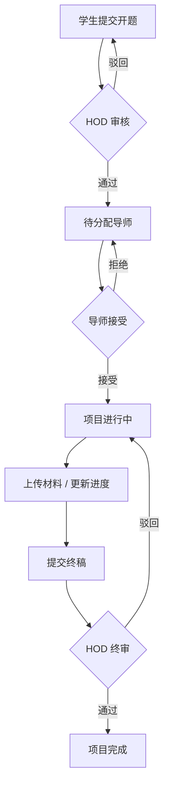

# ProjectSphere

毕业设计 / 科研项目服务系统。面向学生、教师、系主任（HOD）与管理员，覆盖从开题申报到最终交付的完整流程。

支持 **Docker Desktop 一键启动**，默认本地离线模式：无需外网、SMTP、Cloudinary。

---

## 功能概览

- 角色隔离工作台：Student / Faculty / HOD / Admin
- 开题审批 → 导师分配 → 里程碑与进度 → 终稿提交与验收
- 本地文件上传与版本记录（`/uploads`）
- 站内通知、公告、团队协作与图表统计
- JWT 鉴权 + bcrypt 密码哈希 + 角色路由守卫

### 业务流程



---

## 技术栈

| 层级 | 技术 |
|------|------|
| 前端 | React 19、Vite、TailwindCSS、Framer Motion、Recharts、Axios |
| 后端 | Node.js、Express |
| 数据库 | MongoDB（Docker 内本地实例）+ Mongoose |
| 文件 | Multer + 本地磁盘 `/uploads` |
| 部署 | Docker Compose、Nginx |

---

## 项目结构

```text
ProjectSphere/
├── FRONTEND/              # React + Vite
│   ├── src/
│   ├── Dockerfile
│   ├── nginx.conf         # SPA + /api、/uploads 反代
│   └── vite.config.js
├── BACKEND/               # Express API
│   ├── config/
│   ├── controllers/
│   ├── middleware/
│   ├── models/
│   ├── routes/
│   ├── utils/
│   ├── seed.js            # 演示账号种子数据
│   ├── Dockerfile
│   └── index.js
├── docker-compose.yml
├── .env.example
└── README.md
```

---

## 快速启动（推荐）

### 环境要求

安装并启动 [Docker Desktop](https://www.docker.com/products/docker-desktop/)。

### 一键启动

```bash
cd ProjectSphere
docker compose up -d --build
```

也可在 Docker Desktop 中打开本项目，找到 Compose 应用后直接点击 **Start**。

### 访问地址

| 服务 | 地址 |
|------|------|
| 前端 | http://localhost:7310 |
| 后端 API | http://localhost:5000 |

### 演示账号

容器启动时自动执行 `seed.js`，密码均为 `Admin@1234`：

| 角色 | 登录页 | 邮箱 |
|------|--------|------|
| Admin | `/login/admin` | `admin@projectsphere.com` |
| HOD | `/login/hod` | `hod@projectsphere.com` |
| Faculty | `/login/faculty` | `faculty@projectsphere.com` |
| Student | `/login/student` | `student@projectsphere.com` |

离线模式下：

- 新用户注册后自动完成邮箱验证，可直接登录
- 教职工注册后自动审批
- 忘记密码时 OTP 会显示在页面提示中
- 上传文件保存在 Docker 卷 `upload_data`

### 常用命令

```bash
# 查看日志
docker compose logs -f

# 停止（保留数据）
docker compose down

# 停止并清空数据库 / 上传文件
docker compose down -v
```

---

## 本地开发（可选）

不使用 Docker 时，需本机安装 Node.js 18+ 与 MongoDB。

### 后端

```bash
cd BACKEND
npm install

# 参考根目录 .env.example，在 BACKEND/.env 中配置：
# MONGODB_URI / JWT_SECRET / JWT_REFRESH_SECRET
# LOCAL_OFFLINE=true
# SKIP_EMAIL_VERIFICATION=true

npm run seed
npm run dev
```

API：http://localhost:5000

### 前端

```bash
cd FRONTEND
npm install
npm run dev
```

前端：http://localhost:5173（Vite 已代理 `/api` 与 `/uploads`）

---

## 环境变量

Docker Compose 已内置默认值，一般无需再配。本地开发可在 `BACKEND/.env` 中设置：

```env
PORT=5000
NODE_ENV=development
MONGODB_URI=mongodb://127.0.0.1:27017/projectsphere
JWT_SECRET=your_jwt_secret_token
JWT_REFRESH_SECRET=your_jwt_refresh_token
FRONTEND_URL=http://localhost:5173
LOCAL_OFFLINE=true
SKIP_EMAIL_VERIFICATION=true
ADMIN_EMAIL=admin@projectsphere.com
SEED_PASSWORD=Admin@1234
```

---

## 角色能力摘要

| 角色 | 主要能力 |
|------|----------|
| Student | 开题申报、里程碑、文件上传、终稿提交、团队沟通 |
| Faculty | 接受/拒绝指导、进度与反馈、公告 |
| HOD | 开题审批、分配导师、教职工管理、报表导出 |
| Admin | 全局统计、用户状态管理、系统公告 |

---

## 主要 API

所有接口前缀为 `/api`，受保护接口需携带 JWT。

| 模块 | 方法 | 路径 | 说明 | 权限 |
|------|------|------|------|------|
| Auth | POST | `/auth/register/student` | 学生注册 | 公开 |
| Auth | POST | `/auth/register/faculty` | 教职工注册 | 公开 |
| Auth | POST | `/auth/login` | 登录 | 公开 |
| Auth | POST | `/auth/verify-otp` | 验证 OTP（可选） | 公开 |
| Student | GET | `/student/dashboard` | 学生工作台 | Student |
| Student | POST | `/student/proposal` | 提交开题 | Student |
| Student | POST | `/student/files/upload` | 上传文件 | Student |
| Student | POST | `/student/submit-final` | 提交终稿 | Student |
| Faculty | GET | `/faculty/dashboard` | 教师工作台 | Faculty |
| Faculty | PUT | `/faculty/proposals/:id/accept` | 接受指导 | Faculty |
| Faculty | PUT | `/faculty/proposals/:id/progress` | 更新进度 | Faculty |
| HOD | GET | `/hod/dashboard` | HOD 工作台 | HOD |
| HOD | PUT | `/hod/proposals/:id/approve` | 审批开题 | HOD |
| HOD | PUT | `/hod/proposals/:id/assign-faculty` | 分配导师 | HOD |
| Admin | GET | `/admin/stats` | 系统统计 | Admin |
| Admin | GET | `/admin/students` | 学生列表 | Admin |

---

## 安全说明

- JWT Access Token + Refresh Token
- 密码 bcrypt 哈希
- 基于角色的路由中间件隔离
- 默认本地离线认证，不依赖外部邮件服务

---

## 联系方式

- 开发者：Aman Gupta
- Email：ag0567688@gmail.com
- GitHub：https://github.com/amangupta9454
- LinkedIn：https://linkedin.com/in/amangupta9454

---

MIT License
